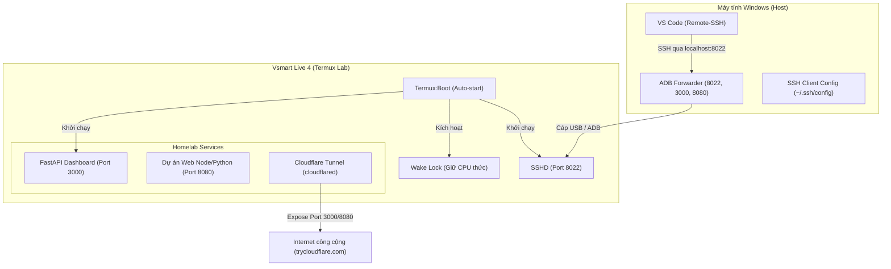

# Termux Homelab Setup Skill - Vsmart Live 4 (Snapdragon 675)
> **Tài liệu hướng dẫn thiết lập hệ thống tự động và xử lý sự cố**

Tài liệu này đóng vai trò là một cẩm nang hướng dẫn giúp thiết lập, lập trình, triển khai (deploy) website và vận hành một điện thoại Android cũ thành một Homelab Mini chạy Termux Native 24/7. Dự án hoạt động ở chế độ không root, không dùng Docker, không dùng Desktop Linux và hoàn toàn chạy native để tối ưu hóa hiệu năng và điện năng tiêu thụ.

---

## Kiến Trúc Hệ Thống (System Architecture)



---

## Quy Trình Thiết Lập Từng Bước (Step-by-Step Setup)

### Bước 1: Chuẩn bị Điện thoại và Windows Host
1. **Bật Developer Options** trên điện thoại: Nhấn 7 lần vào "Build Number" (Số phiên bản) trong phần giới thiệu thông tin điện thoại.
2. **Bật USB Debugging** (Gỡ lỗi USB) trong phần Cài đặt nhà phát triển.
3. Tải bộ công cụ Android SDK Platform-Tools trên Windows và giải nén vào thư mục làm việc hoặc `C:\platform-tools\`.
4. Kết nối điện thoại vào PC qua cáp USB, chạy lệnh kiểm tra trên Windows PowerShell để xác nhận thiết bị đã nhận:
   ```powershell
   C:\platform-tools\adb.exe devices
   ```

### Bước 2: Cài đặt ứng dụng trên Android
* Lưu ý: Phải tải Termux từ các nguồn uy tín cập nhật (F-Droid hoặc GitHub Release), không được tải từ Google Play Store do phiên bản trên đó đã ngưng cập nhật và thiếu các gói package mới.
1. Tải và cài đặt **Termux** phiên bản mới nhất từ F-Droid hoặc GitHub.
2. Tải và cài đặt app phụ trợ **Termux:Boot** để hỗ trợ khởi chạy các script khi khởi động lại thiết bị.

### Bước 3: Loại bỏ tối ưu hóa pin (Battery Optimization Whitelist)
Để hệ điều hành Android không đóng băng hoặc kill các tiến trình chạy ngầm:
1. Vào **Cài đặt** -> **Pin** -> **Tối ưu hóa pin** trên điện thoại.
2. Chuyển trạng thái của **Termux** và **Termux:Boot** sang **Không tối ưu hóa** (Don't optimize).

### Bước 4: Thiết Lập SSH Key-based Authentication
1. **Tạo cặp SSH Key** trên Windows:
   ```powershell
   ssh-keygen -t ed25519 -f C:\Users\<YourUsername>\.ssh\id_ed25519 -N ""
   ```
2. **Chuyển tiếp Public Key lên thiết bị:** Để tránh các lỗi về quyền lưu trữ trên Android, thực hiện đẩy file vào thư mục tạm `/data/local/tmp/`:
   ```powershell
   C:\platform-tools\adb.exe push C:\Users\<YourUsername>\.ssh\id_ed25519.pub /data/local/tmp/id_ed25519.pub
   C:\platform-tools\adb.exe shell chmod 777 /data/local/tmp/id_ed25519.pub
   ```
3. **Cấu hình trên Termux:**
   Kết nối vào Termux và thực thi:
   ```bash
   pkg update -y && pkg install openssh -y
   mkdir -p ~/.ssh
   chmod 700 ~/.ssh
   # Chuyển đổi và làm sạch ký tự ngắt dòng từ Windows sang Unix
   cat /data/local/tmp/id_ed25519.pub | tr -d '\r' >> ~/.ssh/authorized_keys
   chmod 600 ~/.ssh/authorized_keys
   sshd
   ```

### Bước 5: Cấu hình Host Alias trên Windows
Mở hoặc tạo file `C:\Users\Admin\.ssh\config` trên Windows và thêm cấu hình sau để tạo phím tắt kết nối nhanh (cả không dây và có dây):
```text
# Kết nối không dây qua mạng ảo Tailscale
Host homelab
    HostName <IP_TAILSCALE_CUA_BAN>           # Xem bằng lệnh: tailscale ip -4
    User <TERMUX_USERNAME>                    # Xem bằng lệnh: whoami (trong Termux)
    Port 8022
    IdentityFile ~/.ssh/id_ed25519
    StrictHostKeyChecking no
    UserKnownHostsFile /dev/null

# Kết nối có dây qua cáp USB (Dùng khi debug bằng ADB Port Forwarding)
Host homelab-usb
    HostName 127.0.0.1
    User <TERMUX_USERNAME>                    # Xem bằng lệnh: whoami (trong Termux)
    Port 8022
    IdentityFile ~/.ssh/id_ed25519
    StrictHostKeyChecking no
    UserKnownHostsFile /dev/null
```

---

## Cẩm Nang Xử Lý Lỗi (Troubleshooting and Key Insights)

### 1. Vấn đề AP Isolation của Router (Không SSH được bằng IP LAN)
* **Triệu chứng:** PC và điện thoại cùng kết nối một Wi-Fi, nhưng không thể kết nối SSH trực tiếp bằng IP LAN.
* **Nguyên nhân:** Router Wi-Fi bật chế độ AP Isolation (WLAN Partition) ngăn chặn các thiết bị không dây kết nối trực tiếp với nhau.
* **Khắc phục 1:** Sử dụng cáp USB và thiết lập ADB Port Forwarding từ Windows:
  ```powershell
  C:\platform-tools\adb.exe forward tcp:8022 tcp:8022
  C:\platform-tools\adb.exe forward tcp:3000 tcp:3000
  ```
* **Khắc phục 2:** Cài đặt và đăng nhập Tailscale trên cả hai thiết bị để tạo mạng VPN ảo kết nối trực tiếp.

### 2. Lỗi ký tự ngắt dòng Windows (\r\n) trong authorized_keys
* **Triệu chứng:** Kết nối SSH báo lỗi `Permission denied (publickey)` mặc dù key hoàn toàn chính xác.
* **Nguyên nhân:** File public key của Windows chứa ký tự xuống dòng `\r\n` mà SSH Daemon của Linux không thể đọc đúng định dạng.
* **Khắc phục:** Lọc ký tự `\r` bằng lệnh:
  ```bash
  tr -d '\r' < ~/.ssh/authorized_keys > ~/.ssh/authorized_keys.tmp && mv ~/.ssh/authorized_keys.tmp ~/.ssh/authorized_keys
  chmod 600 ~/.ssh/authorized_keys
  ```

### 3. Giới hạn Scoped Storage trên Android 10+
* **Triệu chứng:** Push file qua ADB vào `/sdcard/` thành công nhưng cp vào thư mục home của Termux báo `Permission denied`.
* **Nguyên nhân:** Hệ điều hành Android giới hạn quyền truy cập bộ nhớ ngoài của các ứng dụng sandbox.
* **Khắc phục:** Sử dụng `/data/local/tmp/` làm cầu nối trung gian để truyền tải dữ liệu.

### 4. Lỗi script tự động tắt (Self-termination) do pkill
* **Triệu chứng:** Script quản lý tự dừng hoạt động trước khi thực hiện xong lệnh.
* **Nguyên nhân:** Chạy lệnh `pkill -f sshd` trong script để restart SSH daemon. Lưu ý cờ `-f` kiểm tra toàn bộ chuỗi command line. Nếu tên script có chứa từ khóa `sshd` (ví dụ: `start_sshd.sh`), script sẽ tự nhận diện và tự kill chính nó.
* **Khắc phục:** Chỉ dùng `pkill sshd` để xác định đúng tên process.

---

## Tập Lệnh Mẫu Cho Homelab (Standard Scripts)

Đặt các tập lệnh này tại `~/homelab/scripts/` để vận hành hệ thống:

### 1. Khởi động API Dashboard (`start-api.sh`)
```bash
#!/data/data/com.termux/files/usr/bin/bash
SESSION="test-api"
API_DIR="$HOME/homelab/apis/test-api"
PORT=3000
LOG="$HOME/homelab/logs/api.log"

if tmux has-session -t "$SESSION" 2>/dev/null; then
    echo "Session '$SESSION' dang hoat dong."
    exit 0
fi

mkdir -p "$(dirname "$LOG")"
tmux new-session -d -s "$SESSION" -c "$API_DIR" "uvicorn main:app --host 0.0.0.0 --port $PORT 2>&1 | tee -a $LOG"
sleep 2
if tmux has-session -t "$SESSION" 2>/dev/null; then
    echo "API da khoi dong tren port $PORT (Tmux: $SESSION)"
else
    echo "Khoi dong that bai. Kiem tra log tai: $LOG"
fi
```

### 2. Giám sát tài nguyên (`status.sh`)
```bash
#!/data/data/com.termux/files/usr/bin/bash
echo "=== HOMELAB STATUS REPORT ==="
echo ""
echo "Uptime:" && uptime
echo ""
echo "RAM:" && free -h
echo ""
echo "Storage:"
df -h ~ | awk 'NR==2 {printf "  Total: %s  Used: %s (%s)  Free: %s\n", $2, $3, $5, $4}'
echo ""
echo "Tmux Sessions:" && tmux ls 2>/dev/null || echo "  No active sessions"
echo ""
echo "API status (port 3000):"
ss -tlnp 2>/dev/null | grep -q ":3000 " && echo "  ONLINE" || echo "  OFFLINE"
echo ""
echo "Temperatures:"
for sensor in cpu-1-1-usr cpuss-3-usr gpu-usr battery xo-therm sdm-therm; do
    if [ -d "/sys/class/thermal" ]; then
        for zone in /sys/class/thermal/thermal_zone*; do
            type=$(cat "$zone/type" 2>/dev/null)
            if [ "$type" = "$sensor" ]; then
                temp=$(cat "$zone/temp" 2>/dev/null)
                echo "  $type: $((temp/1000))C"
            fi
        done
    fi
done
```

### 3. Tập lệnh tự khởi động khi reboot (`start-homelab.sh` cho Termux:Boot)
Lưu tại: `~/.termux/boot/start-homelab.sh`
```bash
#!/data/data/com.termux/files/usr/bin/bash
# Ngăn CPU đi vào deep sleep
termux-wake-lock

# Khởi chạy SSH server
sshd

# Chờ mạng kết nối ổn định
sleep 10

# Khởi động API Dashboard
bash ~/homelab/scripts/start-api.sh
```

---

## Hướng Dẫn Triển Khai & Lập Trình (Developer and Deploy Guide)

### 1. Kết nối qua VS Code Remote-SSH
1. Mở VS Code trên Windows, cài đặt extension **Remote - SSH** của Microsoft.
2. Bấm tổ hợp `Ctrl + Shift + P`, chọn `Remote-SSH: Connect to Host...` và chọn **homelab**.
3. Khi kết nối thành công, bấm `File -> Open Folder` và mở thư mục làm việc của bạn tại `/data/data/com.termux/files/home`.

### 2. Triển khai nhanh Web App
Sử dụng script `deploy-website.sh` có sẵn để tự động sinh mã nguồn cho website mới:
```bash
bash ~/homelab/scripts/deploy-website.sh
```
Sau đó lựa chọn project muốn khởi tạo (Static HTML, Node.js Express hoặc FastAPI).

### 3. Expose cổng ra ngoài Internet (Cloudflare Tunnel)
Expose website chạy ở cổng 8080 thông qua Cloudflare Quick Tunnel:
```bash
bash ~/homelab/scripts/start-tunnel.sh 8080
```
Script sẽ tự động khởi chạy `cloudflared` chạy ngầm và trả về một URL công khai để bạn có thể share hoặc test từ xa.
